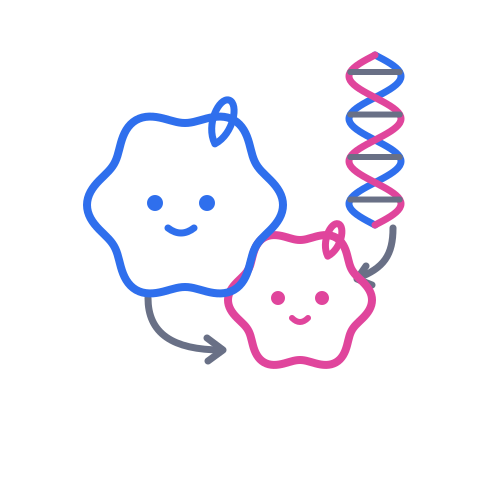

<div align="center">



# dolly

**Sincronização de diretórios locais via [rclone](https://rclone.org/)** — exclusões configuráveis, deleção espelhada opcional, múltiplos pares source/destination e um resumo estilo `git status`.

[](https://www.gnu.org/software/bash/)
[](https://rclone.org/)


</div>

---

O nome é um trocadilho: **Dolly**, a ovelha **clonada**, e o *clone* de diretórios que o script faz — usando `rclone` por baixo dos panos.

## ✨ Recursos

| | |
|---|---|
| 🔁 | Múltiplos pares `source → destination` na mesma execução |
| 🧪 | Modo `--dry-run`: simula tudo sem copiar ou apagar nada |
| 🪞 | Deleção espelhada opcional via `--mirror` (por padrão, nada é apagado no destino) |
| 🚫 | Exclusões configuráveis com a sintaxe `--filter-from` do rclone |
| 📋 | Resumo estilo `git status` (`+` adicionado, `*` modificado, `-` removido) |
| 🗂️ | Logs organizados por execução, com viewer e limpeza automática por idade |

## 📦 Instalação

```sh
chmod +x dolly
ln -s "$(pwd)/dolly" ~/.local/bin/dolly   # garanta que ~/.local/bin está no PATH
```

**Requisitos**

- [`rclone`](https://rclone.org/downloads/) — obrigatório, precisa estar no `PATH`.
- Um editor de texto (`nano`, `vim` ou `vi`) — usado por `--edit-path`/`--edit-filter`.
- [`bat`](https://github.com/sharkdp/bat) — opcional, usado por `--view-log` para colorir a saída; sem ele, cai para `cat`.

## 🚀 Uso

```sh
dolly init              # cria os arquivos de configuração e diretórios de log
dolly --dry-run         # simula a sincronização, nada é copiado/apagado (atalho: -d)
dolly                   # executa de fato, pede confirmação (por padrão, nunca apaga no destino)
dolly -y                # executa sem pedir confirmação
dolly --mirror          # ativa deleção espelhada: apaga no destino o que não existe mais na origem (atalho: -m)
dolly --edit-path       # abre paths.conf no editor disponível (atalho: -ep)
dolly --edit-filter     # abre filters.txt no editor disponível (atalho: -ef)
dolly --view-log        # escolhe dry-run/prod e uma das últimas execuções para ver os logs (atalho: -vl)
dolly --log-delete      # apaga execuções com mais de 30 dias, dry-run e prod (atalho: -lgd)
dolly -h                # ajuda
```

> Por padrão cada par roda com `rclone copy` (só copia/atualiza, nunca apaga).
> Com `--mirror`/`-m`, roda `rclone sync` (espelha a origem, apagando extras no destino) — ex.: `dolly -y --mirror`.

Qualquer flag não reconhecida pelo dolly (ex.: `--bwlimit 1M`, `--transfers 8`, `--exclude "*.tmp"`) é repassada direto para o rclone de cada par:

```sh
dolly -y --bwlimit 1M --transfers 4
```

<details>
<summary><strong>Ver todos os comandos</strong></summary>

```sh
dolly init
dolly --dry-run
dolly -y
dolly -y --mirror
dolly --edit-path
dolly -y --bwlimit 1M --transfers 4
dolly --log-delete
dolly -lgd 15                  # apaga execuções com mais de 15 dias
dolly --view-log
dolly --view-log --dir 10      # escolhe entre as 10 execuções mais recentes (padrão: 5)
```

</details>

## ⚙️ Configuração

Depois de `dolly init`, edite:

| Arquivo | Descrição |
|---|---|
| `~/.config/dolly/paths.conf` | Pares `source\|destination`, um por linha |
| `~/.config/dolly/filters.txt` | Regras de exclusão no formato [`--filter-from`](https://rclone.org/filtering/) do rclone (ex.: `- .git/**`) |

## 🗂️ Logs

Cada execução grava seus logs em:

```text
~/.local/share/dolly/logs/dry-run/<timestamp>/
~/.local/share/dolly/logs/prod/<timestamp>/
```

Dentro de cada pasta, por par sincronizado:

- `<job>.rclone.log` — saída técnica detalhada do rclone.
- `<job>.changes.log` — lista estilo git status (`+` adicionado, `*` modificado, `-` removido). A linha `-` só aparece em execuções com `--mirror`.

E um `summary.log` com o resumo agregado de todos os pares da execução.

`dolly --view-log` pergunta se você quer ver execuções de `dry-run` ou de `prod`, lista as execuções mais recentes para escolher e, se houver mais de um job na execução escolhida, pede para selecionar qual arquivo ver antes de exibir o conteúdo.

`dolly --log-delete` remove execuções (dry-run e prod) mais antigas que N dias — 30 por padrão.
